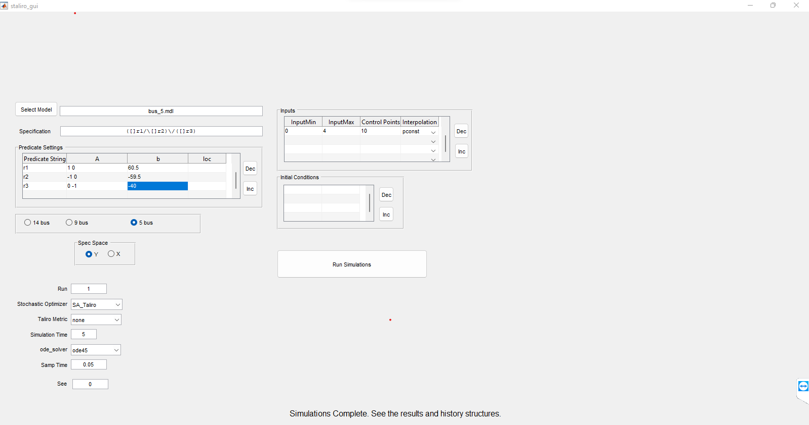

User Guide
===========

We have developed a tool to find a stealthy-attack vectors that tampers sensor/actuator data. These attack-vectors target various vulnerable points on Smart-Grid causing un-natural behavior without getting detected by anomaly detectors. We use a methodology that synthesizes attack vector using a learning-based probablistic engin and a stochastic optimization-based formal engine.

GUI description
================
This tool uses a simulink file with .mdl extension as input from user. It uses a reinforcement -learning frame-work from simulink and a formal tool S-Taliro to generate a stealthy attack vector.

