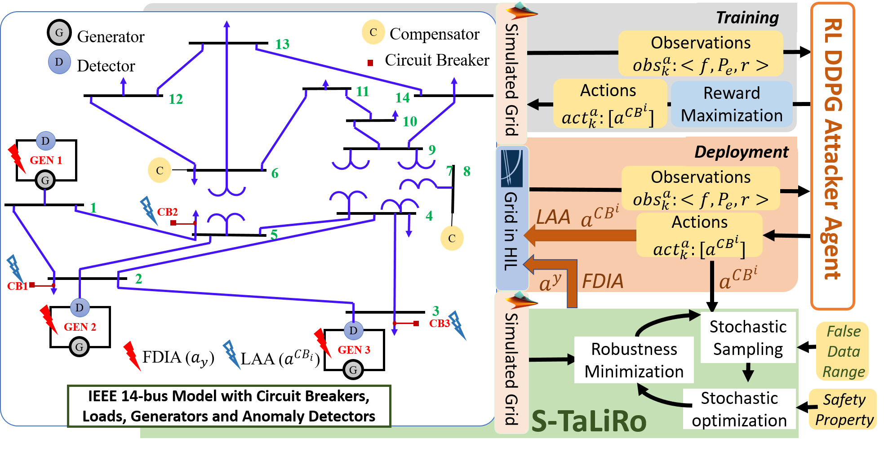

User Guide
===========

We have developed a tool to find stealthy-attack vectors that tamper the sensor and actuator data of Smart Grid. These attack vectors target specific components of the grid causing abnormal behavior like brown-outs, without getting discovered by the anomaly detectors present in the grid. We use a methodology that synthesizes attack vectors using a learning-based probabilistic engine (Reinforcement Learning (RL)) and a stochastic optimization-based formal engine (S-Taliro). As a first phase, a Reinforcement Learning (RL)-based attacker agent learns to inject the most effective input load altering attack (LAA) sequences  to push the system to its transient states for an elongated period as quickly as possible without raising any alarm. The probabilistic LAA sequences thus recovered are automatically augmented in the system model. This is given as input to a well-known simulation-based falsification engine S-TaLiRo that synthesizes false data injection attack (FDIA) sequences with the aim to falsify the set points of the generation unit. These additional FDIA perturbations thus uncovered, are formally guaranteed to send the generator units out of synchrony with the rest of the power grid exploiting the transient characteristics induced by the RL agent while maintaining stealth.

GUI description
================
This tool combines False Data Injection (FDI) and Load Alteration (LA) attacks to make a power grid unstable while remaining undetected by the detection units present in a grid. The load alteration attacks are induced by a reinforcement learning (RL) agent and the FDI attacks are done by a simulation based formal tool STaliro.

This tool requires an user to input a power grid Simulink model with. mdl extension. The user is also required to label the points in the simulink model where he desires to attack.

## Simulink work-around
The user simulink model needs some work around. 
* The Simulink file should have .mdl extension
* Use "inport" block to collect attack vectors from the tool. Use "demux" block to split vectors generated from "RL-agent" and "S-taliro"(index 1 is vector generated from "RL-agent", index 2 is vector generated from "S-taliro")

Getting Started
================
We now give a step-by-step demonstration of how the tool works.

**Step 1:**
The user uploads his/her power grid model (eg. IEEE (5 bus, 9 bus, 14 bus, 39 bus)) to the tool by pressing the Select Model button. The file explorer button pops up from where the user can select his/her power grid simulink model.

**Step 2:**
In the specification tab, the user enters the safety properties for the power grid (i.e, the upper and lower bound limit for power grid frequency) and set the point value for the detection unit in the grid in the form of the MTL equation. 

In the above figure r1 represents upper safety limit for grid frequency and r2 represents lower safety limit for grid frequency. r3 represents the threshold value for the residue based detection unit.

**Step 3:**
In the Predicate settings tab, the user maps the logic specification in step 2 to the predicates over the output space of the model.
For example, Suppose there are two outputs x = [y1,y2]. Where let y1 be the frequency of a generator in the grid and y2 is the residue value of the detection unit attached to that generator.
 Predicate r1 checks if y1 < = b1 (b1 is a constraint).
 therefore matrix A = [1 0] such that Ax <= b1
 similarly to check y1 >= b2 (b2 is a constraint) , A = [-1 0]  such that -Ax <= -b2 which implies Ax >= b2.
 
 
 **Step 4:**
 The user specifies which IEEE bus architecture did he/she upload. 
 

**Step 5:**
The user specifies how many times the simulink model will execute by pressing the Number of run button

**Step 6:**
The user specifies the time duration in seconds for which the simulation is to be continued in the Simulation Time tab.

**Step 7:**
The user chhoses a solver for the simulink model using this tab. 

**Step 8:**
Time time step at which the model will be executed is specified in the Sample Time tab. 

**Step 9:**
The initial value for false data generation is specified by the user in this tab.  

**Step 10:**
Here in InputMin and InputMax the user specifies the input range for false-data injection, in Control Points tab the samples points for false-data injection is selected by the user, in interpolation type the user specifies how to insert false-data in the simulation time.  

**Step 11:**
Finally the user starts the simulation by pressing the run simulation button. 

